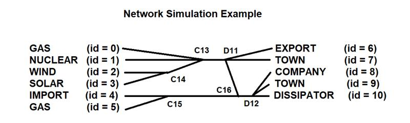
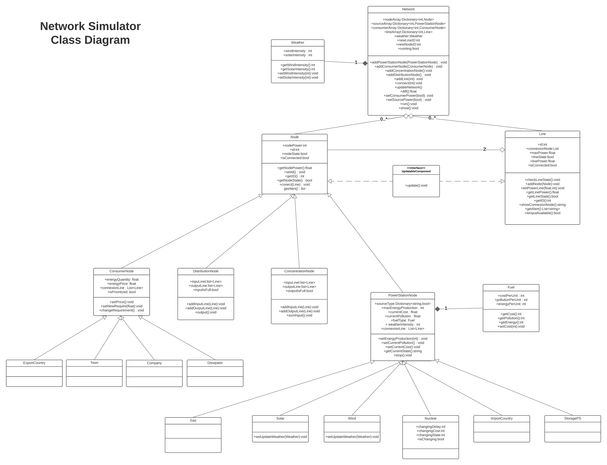
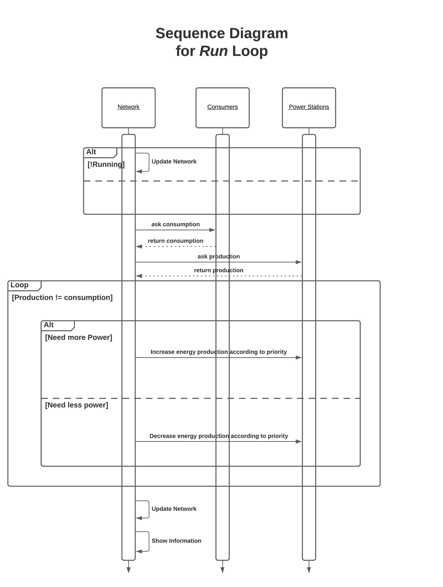

# **Projet Simulateur Réseau Électrique**

Dans le cadre du cours de “Programmation Orienté Objet”, nous avons développé une plateforme de simulation de réseau électrique afin de pouvoir simuler le comportement dynamique d’un ensemble de centres de production d’électricité et d’un ensemble de consommateurs. Pour ce faire nous avons utilisé le langage de programmation C#. Pour lancer le programme il faut d'abord créer un projet csharp vierge et copier le contenu du dossier *Simulator* dans votre projet. Il suffit après d'executer le fichier *Program.cs* dans le dossier *Main* pour lancer la démonstration. Assurez vous d'avoir une version du framework DOTNet >= 5.0 afin d'assurer la comptabilité du projet.

## **1. Classes :**

Les principales classes présentes dans ce projet sont les suivantes :

- *Network :*

Contrôle tout le réseau électrique regroupant les nœuds, les lignes dans des dictionnaires, un objet météo. C’est dans cette classe que l’on va pouvoir réaliser la simulation.

- *Line :*

Permet de lier deux éléments du réseau. Chaque ligne est caractérisée par une puissance maximale, d’une puissance de ligne, d’un id unique, d’un état d’activité sur le réseau et d’un état de connexion (vrai).

- *Node :*

Tous les éléments que l’on peut rajouter dans le réseau (mis à part les lignes) sont des objets de type nœud. Ils sont caractérisés par une puissance, un id unique et un état d'activité sur le réseau. Un nœud contient la ligne à laquelle il est connecté.

- *ConsumerNode :*

Ce sont des nœuds de type consommateurs. On retrouve les villes (Town), les entreprises (Company), les dissipateurs (Dissipator) où des consommateurs étrangers (ExportCountry). 

- *DistributionNode :*

Ce sont des nœuds qui permettent d’envoyer sur plusieurs lignes l’énergie qu’ils reçoivent sur leur unique entrée et ce de manière équivalent sur chaque sortie.

- *ConcentrationNode :*

Ces nœuds permettent de concentrer l’énergie provenant de plusieurs lignes en entrée afin de sortir sur une unique ligne la somme totale des énergies à son entrée.

- *PowerStationNode :*

Cette classe concerne des sources de production d’électricité telles que les centrales au gaz (GasPS), les énergies solaire (SolarPS), les parcs éolien (WindPS), les centrales nucléaires (NuclearPS) et l’achat d’électricité à l’étranger (ImportCountry) qui a la particularité de ne pas avoir une production maximale fixe contrairement aux autres sources qui peuvent avoir une production d’énergie constante et/ou variable et/ou dépendant de la météo.

- *Fuel :*

Classe qui permet de spécifier le type de carburant de chaque centrale de production ainsi que son prix et la pollution et son énergie produite par unité.

- *Weather :*

Classe permettant de paramétrer et simuler la météo pour les centrales solaires et le parc éolien.

- *UpdatableComponent :*

Interface qui permet de mettre à jour les classes d'objets qui l’implémentent.

## **2. Les fonctionnalités :**

- Création d’un réseau électrique permettant de contenir des objets (lignes et nœuds).

- Fonction permettant de rajouter les éléments sur le réseau (les nœuds de distribution et de concentration, les consommateurs et les sources). L'attribution des ids des objets est entièrement gérée par le réseau et de manière automatique.

- Fonction permettant de mettre à jour tous les éléments composant le réseau.
- Simuler une demande variable des consommateurs.

- Fonction qui permet de répondre à la demande d’énergie des consommateurs avec une gestion basique des priorités au niveau du choix des sources de production d’énergie à modifier.

- Une fonctionnalité de météo associée au réseau entièrement paramétrable sur l’intensité lumineuse et du vent afin de simuler les productions d’énergie des sources de production dépendante de la météo.

- Des nœuds de concentration permettant de regrouper plusieurs entrées et combiner leur puissance en une unique sortie.

- Des nœuds de distribution permettant de distribuer de manière équitable l’énergie réceptionnée sur son unique entrée vers ces différentes sorties.

- Des consommateurs dont leur consommation électrique est modifiable (villes, entreprises, dissipateurs et export vers les pays étrangers).

- Des sources qui permettent de fournir de l’énergie à des consommateurs (centrales à gaz, centrales nucléaires, panneaux solaires et parcs éoliens). Une source peut être une combinaison des 3 caractéristiques suivantes : flexible, dépendante de la météo et production infinie.

- Fonction permettant de connecter différents éléments au moyen d'une ligne.

- Possibilité de mettre à jour le coût du carburant suivant les prix du marché.

- Possibilité d’ajouter une source de stockage.

## **3. Organisation et fonctionnement générale :**

Le code est divisé en plusieurs dossiers dont le dossier *Main*, qui contient le fichier *Progam.cs*, la classe *Network* qui donne accès à tous les outils pour créer un réseau et des objets, la classe *Weather* qui implémente la météo liée au réseau ainsi que l'interface IUpdatableComponent qui permet de définir les mis à jour de tout les objets qui l'implémentent. Il y 4 dossiers *Consummer*, *PowerStation*, *Distribution et* Concentration reprenant respectivement les 4 grandes classes de nœuds (consommateur, source, nœud de distribution et concentration.

La structure du stockage des différents éléments du réseaux se fait au moyen de dictionnaires. On y ajoute chaque objet et son id associé (généré automatiquement par le réseau) dans cette structure de donnée. Il y a 4 dictionnaires au total. Les consommateurs et les sources d’énergie sont préalablement séparés dans 2 dictionnaires indépendants. Il y a un dictionnaire principal contenant tous les objets de type nœud et un dictionnaire contenant toutes les lignes.

Dans le fichier *Program.cs*, on crée le réseau et on y ajoute les éléments souhaités. On lance la simulation au moyen de la méthode *run* du réseau qui s’occupe de mettre à jour la production d’énergie en fonction de la consommation énergétique des consommateurs. Cette méthode *run* sera appelée toutes les secondes au moyen de la librairie *Timer* dans la fonction *OnTimeEvent*.

Au terme de chaque *network.run*, la mise à jour des éléments du réseau est réalisée par la méthode *network.update* Cette dernière met à jour toutes les lignes du réseau en appelant les méthodes update des nœuds qu'elle relie. On met évidemment à jour uniquement les lignes qui sont connectées des deux côtés. Les lignes et les nœuds implémentent toutes et tous l’interface *IUpdatableComponent.* 

La mise à jour des lignes se fait dans un ordre spécifique afin de respecter certaines conditions. En effet il faut s’assurer que le nœud à l’entrée d’une ligne a déjà été mis à jour avant de mettre à jour le nœud à la sortie. Ce sont les nœuds qui appellent la méthode *update* de la ligne qui met à jour sa puissance transmise tout en vérifiant qu’elle ne dépasse pas sa capacité maximale de transmission, auquel cas la ligne affichera un message d’erreur et changera son état *nodeState* en inactif (false).

Concernant les nœuds de concentration, on va additionner les puissances qu’ils reçoivent en entrée pour l’envoyer vers la ligne de sortie. Quant aux nœuds de distribution, on va diviser leur puissance d’entrée entre toutes les sorties de manière équivalente.

Pour les différents consommateurs du réseau, on réceptionne l’énergie de la ligne et on vérifie si cette énergie est supérieure à la demande, auquel cas on envoie un signal d’erreur et on passe l’état *nodeState* en inactif (false).

Finalement, pour les centrales de production, on actualise la production en allumant ou éteignant des centrales. On vérifie aussi qu’elles sont les conditions météorologiques (vent, soleil) pour actualiser la production des centrales dépendantes de la météo. En fonction de cette nouvelle production, on calcule le coût et l’émission de CO2.

Le réseau simule une demande et décide ensuite quelles sources activer ou éteindre afin d’augmenter ou diminuer la production et satisfaire ainsi la demande. Pour ce faire il change la production selon des priorités prédéfinies. 

Dans le cas où la demande est supérieure à l’offre, on diminue en priorité la dissipation d’énergie, ensuite on peut modifier la production provenant des énergies renouvelables. Si ça ne suffit pas, on augmente la production des centrales qui sont flexibles, et en ultime recourt on comble le manque par l'importation d’énergie. Si l'une des solutions n'est pas disponible (car inexistante) ou encore qu'après tout les changements il reste encore un manque, le réseau le fera savoir au moyen d'un message d'avertissement.

Dans le deuxième cas où, si l’offre est plus grande que la demande, on envoie l'énergie en exportation en priorité.  S’il y a surplus, on diminue la production des centrales flexibles indépendantes de la météo, puis les énergies renouvelables et en dernier recourt on redirige l'énergie vers des dissipateurs. La possibilité de stocker l’énergie est envisagée mais non implémentée dans le simulateur. Si l'une des solutions n'est pas disponible (car inexistante) ou encore qu'après tout les changements il reste encore un un surplus, le réseau le fera savoir au moyen d'un message d'avertissement.

## **4. Commandes :**

### **4.1 Création de réseau :**

- Pour créer un réseau, nous utilisons la commande suivante :
```csharp
private static Network network = new Network();
```
- Ensuite, dans ce réseau, nous créons des centrales de production d’électricité. En paramètre de celles-ci, nous ajoutons le type de centrale avec sa production maximale et son carburant prenant en paramètre un prix, une émission de CO2 et une production par unité. Pour les centrales dépendant de la météo, nous ajoutons un paramètre supplémentaire, la météo liée au réseau.
```csharp
network.addPowerStationNode(new GasPS(15000, new Fuel(10, 10, 100)));
network.addPowerStationNode(new WindPS(500,new Fuel(0,0,50),network.weather));
```
- La création de consommateurs prend en paramètre leur type ainsi que leur demande d’électricité.
```csharp
network.addConsumerNode(new ExportCountry(20000));
```
- Ces deux commandes permettent d'ajouter des nœuds de distributions et des nœuds de concentration :
```csharp
network.addDistributionNode();
network.addConcentrationNode();
```
- Pour ajouter des lignes, il faut indiquer en paramètre leur puissance maximale en MW :
```csharp
network.addLine(100000);
```
- Enfin, nous pouvons connecter les nœuds désirés entre eux grâce à la commande ci-dessous. Elle prend en paramètre un id pour nœud d’entrée et le nœud de sortie, ainsi que l’id de la ligne qui va les relier : 
```csharp
network.connect(FirstNodeId, SecondNodeId, LineId);
```

### **4.2 Modification ou perturbation du réseau :**

- La commande suivante permet de mofidier la production d'énergie d'une source. Celle-ci prend l’id de la centrale recherchée et la nouvelle puissanceen MW souhaitée en paramètre. Une centrale se met à l’arrêt lorsque la production est mise à 0 ou moins (par sécurité) et elle redémarre lorsqu’on lui fourni une quantité supérieure à 0.
```csharp
 powerSource.setEnergyProduction(PowerProduction);
```
- Nous pouvons aussi arrêter n’importe quelle station grâce à sa methode stop :
```csharp
powerSource.stop();
```
- Pour modifier la demande d’électricité d’un consommateur, cette commande-ci est appliquée. Elle prend en paramètre la puissance demandée.
```csharp
consumer.setNewRequirement(PowerIntensity);
```
- Nous pouvons aussi changer la météo du réseau (l’intensité du vent et lumineuse peut varier entre 0 et 100).
```csharp
network.weather.setSolarIntensity(30);
network.weather.setWindIntensity(80);
```
- Le prix du carburant peut être modifié grâce à cette commande : 
```csharp
powerSource.fuelType.setCost(50);
```

### **4.3 Lancement et mise à jour de la simulation :**

- La commande *Run* appliqué au réseau nous permet d'executer la simulation.
```csharp
network.run();
```
- La commande *Start* présent dans le fichier *Program.cs* nous permet de lancer la méthode *run* toutes les secondes. Pour stopper la simulation, il suffit d’appuyer sur la touche « Entrée » du clavier.
```csharp
Start();
```
- La commande *Update*, permet de mettre à jour tout les objets du réseau.
```csharp
network.updateNetwork();
```

## **5. Diagrammes et schémas :**

- **Démonstration de simulation :**


- **Diagramme de classe :**

PDF (<https://ecambxl-my.sharepoint.com/:b:/g/personal/18365_ecam_be/EfQHWx16vSZIrjuTP1L7zVMBN0JaCYRo5zCIg1_p7He8bA?e=OmboXT>)

- **Diagramme de séquence :**

PDF (<https://ecambxl-my.sharepoint.com/:b:/g/personal/18365_ecam_be/ES90ymiYlHxGmR-g7UyaUeEB83_uxbpKwFLxA9VUKArAtA?e=fqS2Ep>)

## Participants au projet :
- MITROVIC Nikola [18365]
- ROQUERO Pedro [17010]
- SAMELSON Nicolas [17288]
